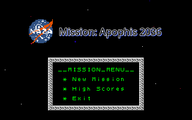
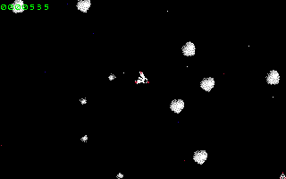
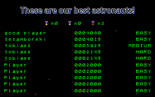
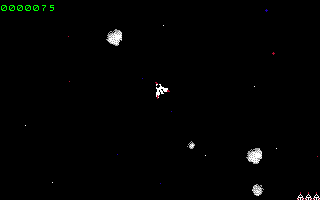

#  Mission: Apophis 2036
A not-trivial clone of asteroids game made in Godot. 🕹️

## Overview
My first and succesful project in Godot. Funny clone of a classic asteroids game with a
somewhat interesting storyline. More detailed description and downloads will be avaible
soon on itch.io.

## Screenshots

## The Story
There is a year 2036. The dangerous asteroid "Apophis" is flying directly into collision with Earth.

National Space Agency was send you with a mission of our last chance. With a mission to rescue the world from the apocalypse!

You have to destroy the asteroid and its leavings. The future of a whole planet is in your hands now...
